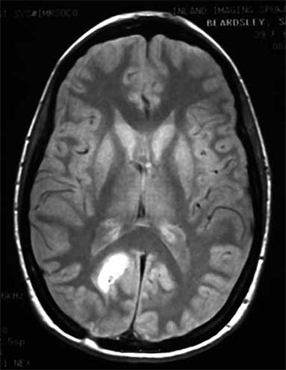
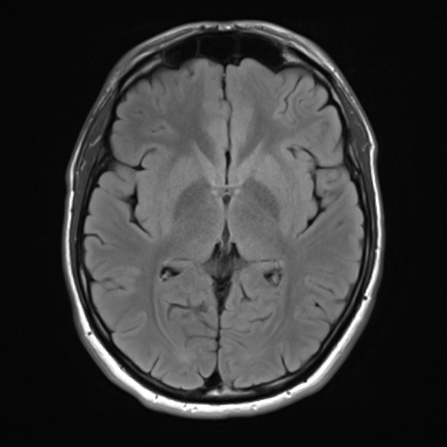

# 🧠 Brain Tumor Detector

An AI-powered deep learning model for detecting and classifying brain tumors from MRI scans.  
It assists in early diagnosis by automating the identification of common tumor types: **glioma**, **meningioma**, and **pituitary** tumors.

---

## 🚀 Features

- 🧬 Convolutional Neural Network (CNN) for image classification  
- 📊 High accuracy on validated MRI datasets  
- 🖼️ Preprocessing with OpenCV  
- 🧪 Test mode for single-image predictions  
- 🧰 GUI interface.

---

## 🖼️ Sample Predictions

| MRI Image | Prediction |
|-----------|------------|
|  | With Tumor |
|  | No Tumor |

---

## 📂 Dataset

This project uses the publicly available [Brain MRI Dataset](https://www.kaggle.com/datasets/ahmedhamada0/brain-tumor-detection) from Kaggle.  
Images are labeled and divided into four categories:

- `glioma_tumor`
- `meningioma_tumor`
- `pituitary_tumor`
- `no_tumor`

---

## 🛠️ Installation

```bash
# Clone the repository
git clone https://github.com/yourusername/brain-tumor-detector.git
cd brain-tumor-detector

# Install required packages
pip install -r requirements.txt
